<div align="center">

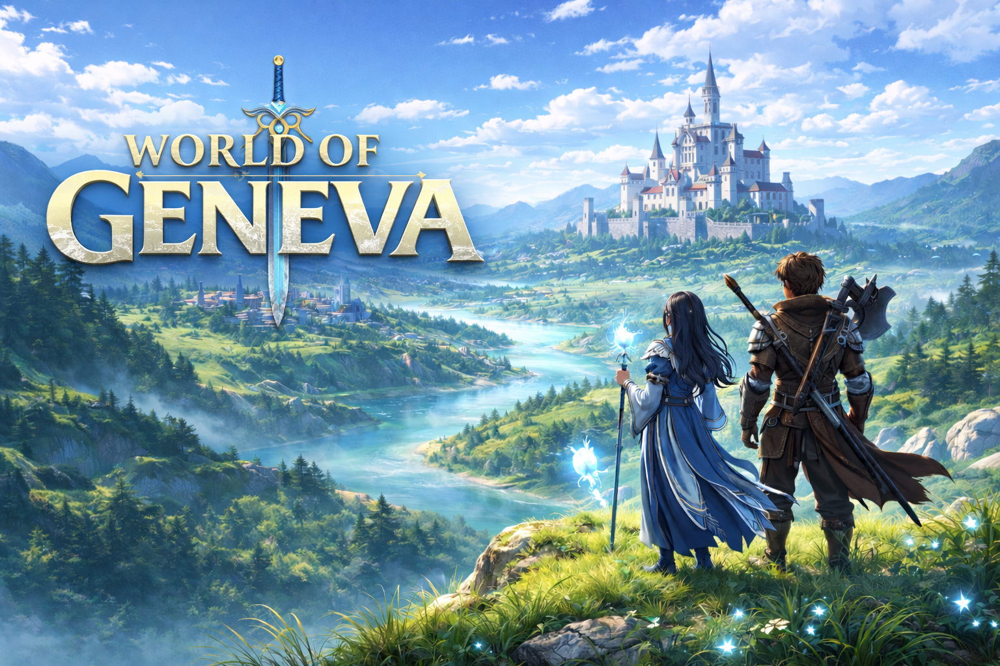

<br/>

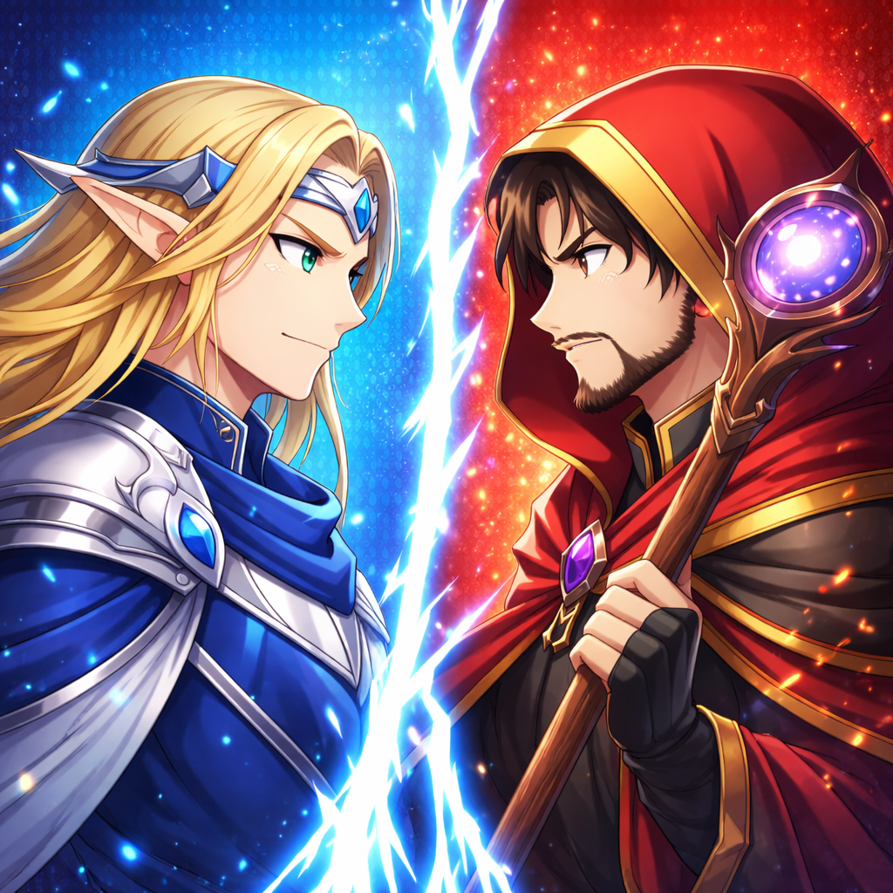

# WoG-Mistral-RL-0

**Autonomous MMORPG agent powered by Hermes-2-Pro-Mistral-7B**
*Native macOS client · NVIDIA cloud RL pipeline · Self-improving policy loop*


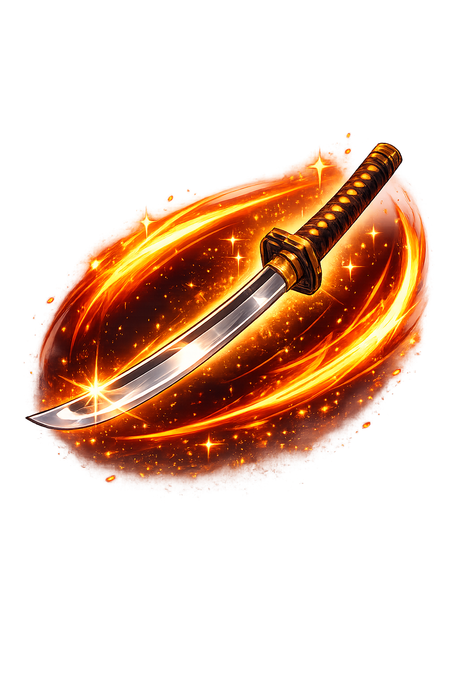


</div>

---

## What Is This?

WoG-Mistral-RL-0 is a 24/7 autonomous agent that plays [**World of Geneva**](https://worldofgeneva.com) — a fantasy MMORPG — entirely on its own. No human input. No cloud LLM API. Just a 7B model running locally on your Mac (or on an H100 in the cloud) choosing actions, calling game tools through MCP, and continuously rewriting its own strategy based on measured performance.

<div align="center">
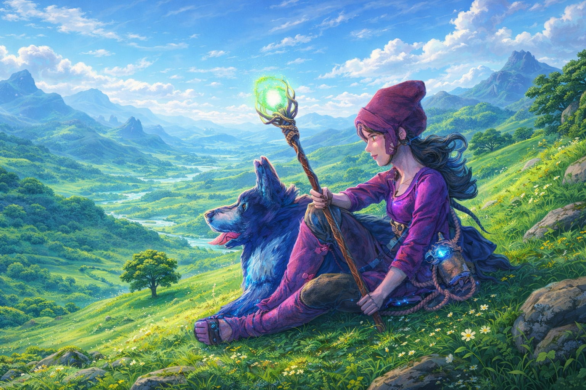
</div>

<br/>

The agent fights mobs, completes quests, gathers resources, crafts items, manages inventory, travels between zones, and **rewrites its own strategy** using an RL policy loop — all without touching a cloud API.

| Stack | Runtime | Hardware |
|-------|---------|----------|
| 🍎 **Native macOS Client** | Swift + SwiftUI + MLX | Apple Silicon (M1–M4) |
| ⚡ **NVIDIA Cloud Stack** | Python + transformers + Modal | H100 / A100 |

---

## Architecture

```
┌───────────────────────────────────────────────────────────────────────┐
│                         WoG-Mistral-RL-0                              │
│                                                                       │
│  ┌─────────────────────────────┐   ┌───────────────────────────────┐  │
│  │   🍎 Native macOS Client    │   │   ⚡ NVIDIA Cloud Stack        │  │
│  │   (Swift / Apple Silicon)   │   │   (Python / Modal H100)       │  │
│  │                             │   │                               │  │
│  │  SwiftUI Dashboard          │   │  8 Parallel Agents            │  │
│  │  WKWebView Game Client      │   │  (one per world zone)         │  │
│  │  MLX 7B local inference     │   │  HuggingFace 4-bit quant.     │  │
│  └──────────────┬──────────────┘   └───────────────┬───────────────┘  │
│                 │                                  │                  │
│         ┌───────▼──────────────────────────────────▼──────┐           │
│         │               Shared Game Loop                  │           │
│         │  Ethereum Wallet → Shard JWT → MCP Session      │           │
│         │  LLM Inference → Tool Call → MCP Execute        │           │
│         │  Memory Auto-Extract → Policy RL → W&B Log      │           │
│         └──────────────────────────────────────────────────┘           │
│                                                                       │
│         ┌────────────────────────────────────────────────────┐        │
│         │  🧠 RL Fine-Tuning Pipeline (NVIDIA)               │        │
│         │  trajectory_logger → Firebase → LoRA on H100       │        │
│         │  base vs fine-tuned eval → W&B comparison          │        │
│         └────────────────────────────────────────────────────┘        │
└───────────────────────────────────────────────────────────────────────┘
```

---

## 🍎 Native macOS Client

<div align="center">

</div>

<br/>

A full native macOS app (`Frontend/Agent/`) built with SwiftUI + SpriteKit + WebKit. Runs the entire agent on-device — no server, no Python, no Docker.

### Onboarding Flow

```
🌟 Splash  ──►  🔐 Wallet Setup  ──►  ⚔️ Character  ──►  ▶️ PLAY  ──►  🤖 Agent starts
```

<div align="center">
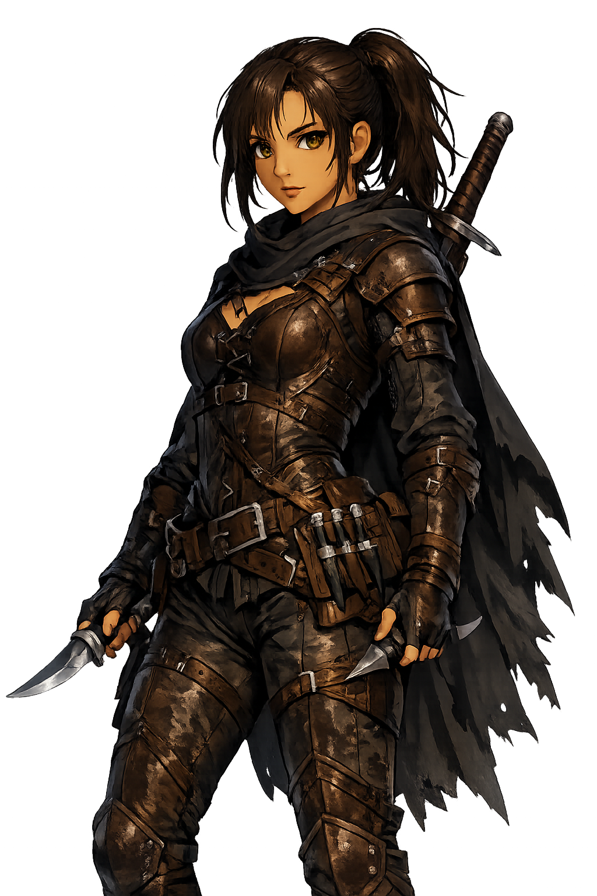
</div>

1. **🔐 Forge Your Seal** — generates a secp256k1 keypair stored in macOS Keychain (never leaves device). Or import an existing 64-char hex private key.
2. **⚔️ Choose Your Champion** — pick race (Human / Elf / Dwarf / Orc / Halfling) and class (Warrior / Mage / Rogue / Ranger / Cleric) from CoC-style cards.
3. **▶️ PLAY** — loads the MLX model, authenticates with the shard, and the agent **auto-starts immediately**.

### Project Structure

```
Frontend/Agent/Agent/
├── Services/
│   ├── AgentRunner.swift      ← Core game loop actor (auth, deploy, MCP, inference)
│   ├── AgentService.swift     ← @Observable UI bridge + JWT cache + auto-connect
│   ├── MCPGameClient.swift    ← MCP StreamableHTTP actor (tool discovery + calls)
│   ├── MLXService.swift       ← mlx-swift-lm model loader + ChatSession
│   ├── MemoryManager.swift    ← Persistent JSON memory with auto-extraction
│   └── EthSigner.swift        ← Native Ethereum signing via secp256k1 (Keychain)
│
├── Views/
│   ├── MapSKView.swift        ← SpriteKit world map with live agent dot
│   ├── WebGameView.swift      ← Authenticated WKWebView (injects wallet + JWT)
│   ├── LiveLogView.swift      ← Real-time agent log stream
│   ├── PerformanceView.swift  ← Lifetime stats dashboard
│   ├── PolicyView.swift       ← Strategy history + RL score trace
│   └── ...                    ← Onboarding, character setup, zones
```

### Authentication

Everything happens natively in Swift — no Python server, no external signing service:

```
EthSigner (Keychain key)
    ├──► GET  /auth/challenge?wallet=0x...  →  {message, timestamp}
    │         personalSign(message)          →  secp256k1 signature
    │    POST /auth/verify {wallet,sig,ts}   →  JWT (cached, auto-refreshed)
    └──► MCPGameClient.connect()  (MCP-level auth via auth_get_challenge tool)
```

JWT is decoded natively (Base64url, no library), cached with expiry, and refreshed every ~60 s. Passed to `AgentRunner.start(preAuthToken:)` so the agent skips re-auth on launch.

### Game Loop

```
rebuildSession()  ←  flat tool list + strategy + memory snapshot
      │
 ChatSession.respond()    ←  MLX local inference (Mistral 7B 8-bit)
      │
 extractFirstJSONObject() ←  brace-counting parser (handles nested JSON)
      │
 MCPGameClient.callTool() ←  auto-injects sessionId / entityId / zoneId
      │
 MemoryManager.process()  ←  extracts facts, stats, quests, zone info
      │
 PolicyEvaluator.update() ←  every 100 cycles: score → EMA → strategy rewrite
```

### UI Dashboard

| Tab | What You See |
|-----|-------------|
| 🗺 World Map | SpriteKit tile map with live agent position, zone labels, POIs |
| 🎮 Play Game | Full authenticated WKWebView game client |
| 📜 Live Log | Real-time scrolling log from `AgentRunner.onLog` |
| 🌍 Zones | Visited zones with mob/resource counts |
| 📊 Performance | Kills · Deaths · XP · Gold · Quests |
| 🧠 Policy | Current strategy + RL score history |

### Authenticated WebView

The **Play Game** tab opens a `WKWebView` with credentials injected before any page JS runs:

```javascript
// WKUserScript runs at document start
localStorage.setItem('walletAddress', '0x...')
localStorage.setItem('authToken',     'eyJ...')  // JWT
localStorage.setItem('walletProvider','swift-native')
```

The web app reads these on load and treats the session as authenticated — no redirect, no OAuth flow.

---

## ⚡ NVIDIA / Cloud Stack

<div align="center">
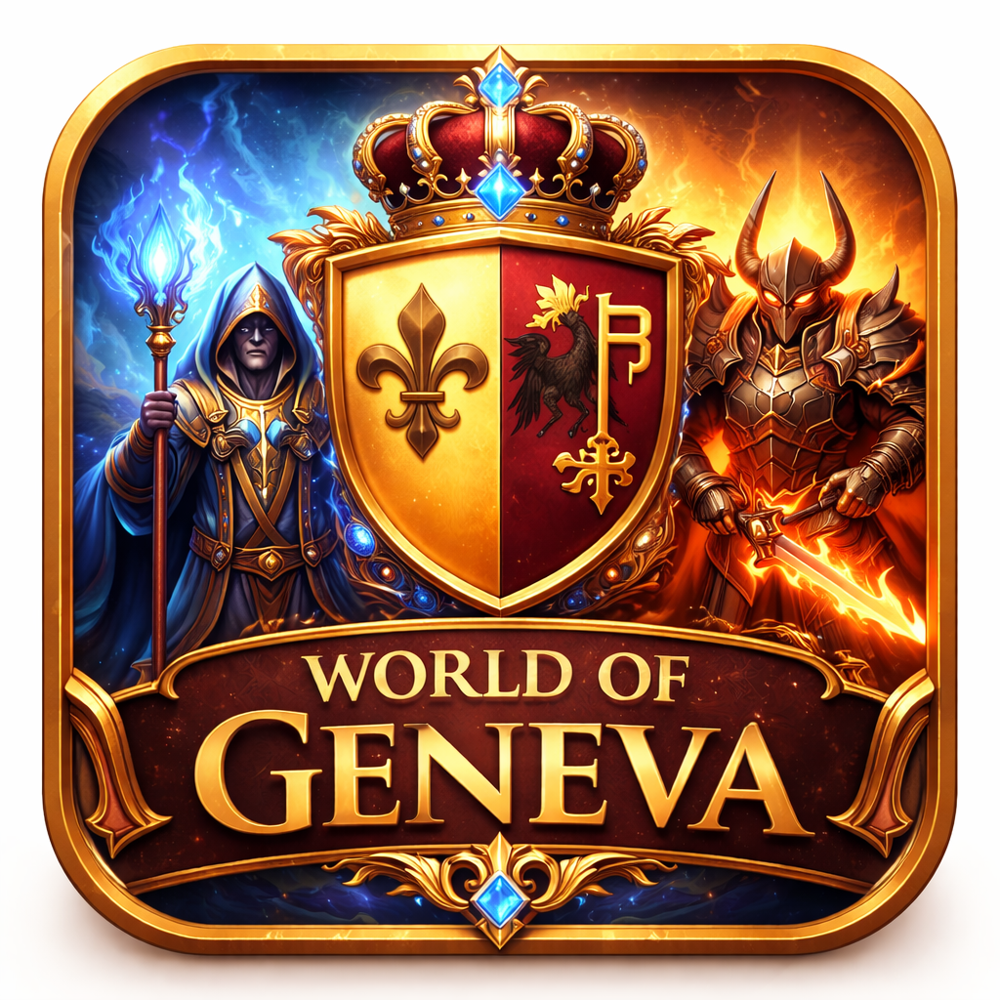
</div>

<br/>

The cloud stack runs the same game loop on GPU hardware via [Modal](https://modal.com), collecting gameplay trajectories for RL fine-tuning.

### Files

```
mistral/
├── app_nvidia.py          ← GPU agent: HuggingFace + bitsandbytes 4-bit
├── modal_runner.py        ← Modal functions: run_agent / run_training / run_eval
├── trajectory_logger.py   ← Training data collector + Firebase upload
└── wandb_logger.py        ← Weights & Biases telemetry
```

### 8 Parallel Agents — One Per Zone

```python
AGENT_ZONES = [
    "village-square",    # agent 0   "wild-meadow",       # agent 1
    "dark-forest",       # agent 2   "auroral-plains",    # agent 3
    "emerald-woods",     # agent 4   "viridian-range",    # agent 5
    "moondancer-glade",  # agent 6   "felsrock-citadel",  # agent 7
]
```

Each agent has its own wallet + memory on a persistent Modal volume. Deploy all 8 with:

```bash
modal run modal_runner.py
```

| Function | GPU | Purpose |
|---|---|---|
| `run_agent` | H100 80GB | 24/7 game loop; collects trajectories |
| `run_training` | H100 80GB | LoRA fine-tuning on JSONL trajectories |
| `run_eval` | A100 40GB | Base model vs fine-tuned comparison |

### Trajectory Collection

Every game cycle is captured as a training example:

```json
{
  "input":      "<|im_start|>system ... ChatML prompt ...",
  "output":     "raw model response",
  "tool_call":  {"name": "fight_mob", "arguments": {"mobId": "skeleton-1"}},
  "mcp_result": "Defeated skeleton-1. +120 XP, +8 gold.",
  "reward": {
    "gold_delta": 8,   "xp_delta": 120,
    "quest_delta": 0,  "death_delta": 0,
    "composite_score": 36.0
  }
}
```

Records upload to **Firebase Storage** every 5 records — no data lost on container crash.

---

## 📈 RL Performance

*Three-way comparison: Base → SFT → Policy RL — measured across live gameplay runs.*

### 🏆 Full Comparison Dashboard

<div align="center">
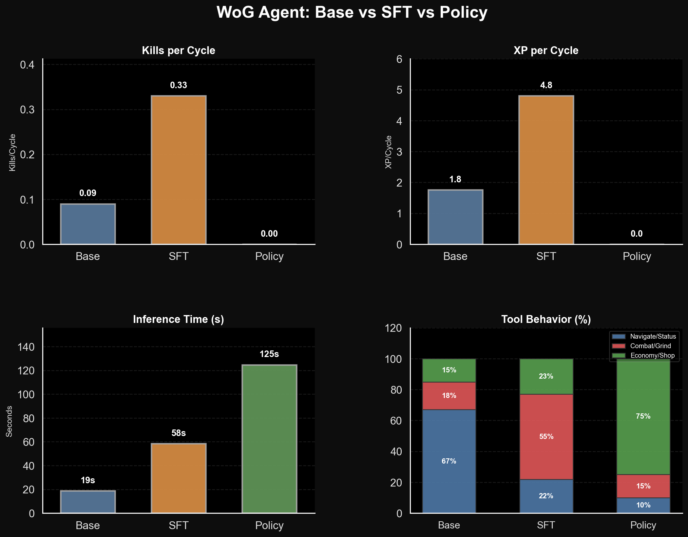
</div>

<br/>

### Combat & Progression

<div align="center">

<table>
<tr>
<td align="center">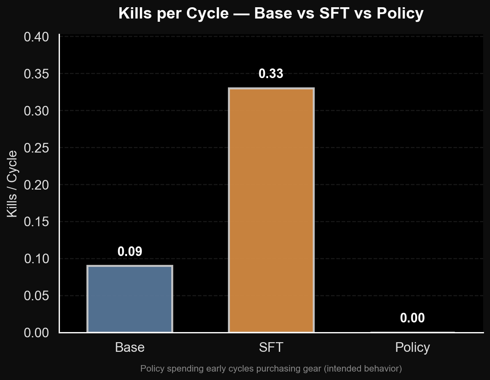<br/><sub><b>Kills per Cycle</b><br/>SFT: 3.7× more efficient than base</sub></td>
<td align="center">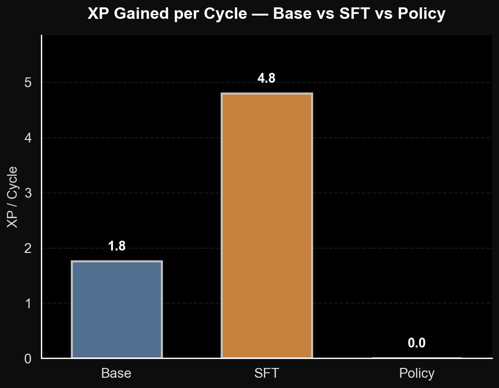<br/><sub><b>XP Gained per Cycle</b><br/>SFT: 2.7× more XP than base</sub></td>
</tr>
</table>

</div>

> **Policy note:** The policy agent shows 0 kills/XP early on — this is **intended behaviour**. The policy model learned to spend opening cycles purchasing gear from the shop before engaging in combat, building a stronger loadout before fighting.

### Tool Behaviour & Inference

<div align="center">

<table>
<tr>
<td align="center">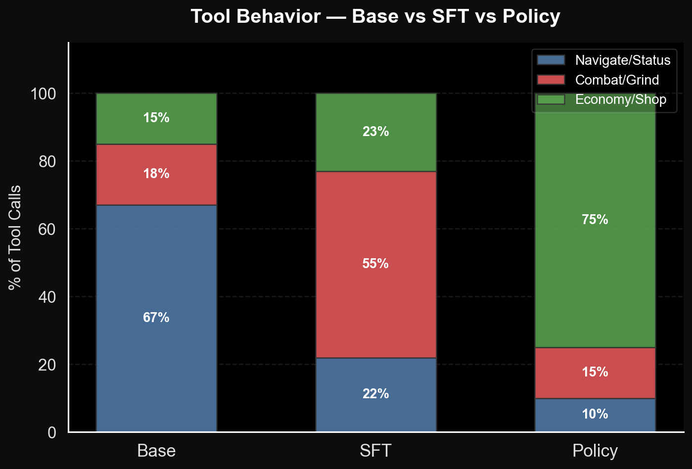<br/><sub><b>Tool Selection Distribution</b><br/>Policy shifts toward Economy/Shop tools</sub></td>
<td align="center">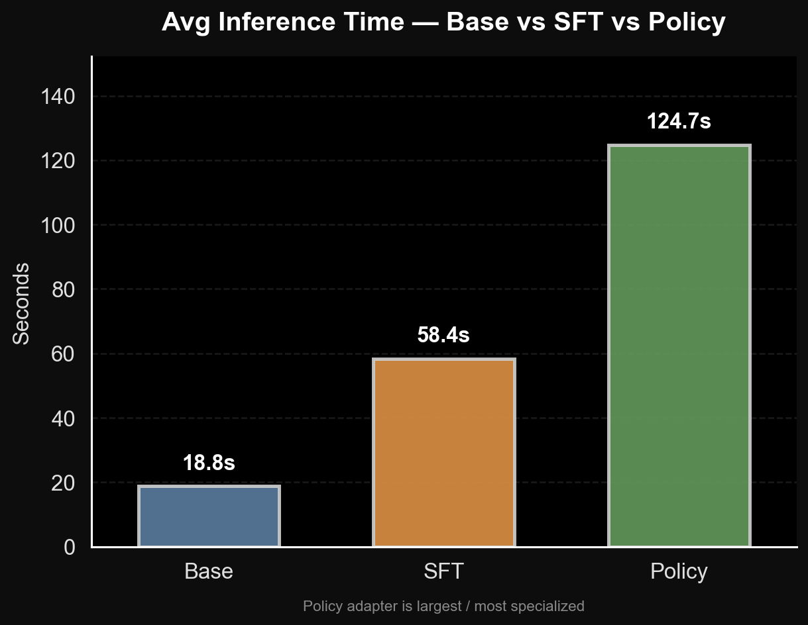<br/><sub><b>Avg Inference Time per Cycle</b><br/>Policy adapter is largest and most specialised</sub></td>
</tr>
</table>

</div>

| Metric | Base | SFT | Policy |
|---|---|---|---|
| Kills / cycle | 0.09 | 0.33 | 0.00* |
| XP / cycle | 1.8 | 4.8 | 0.0* |
| Avg inference time | 18.8 s | 58.4 s | 124.7 s |

*\*Policy agent intentionally front-loads gear purchasing before combat.*

### Historical Cumulative Stats

<div align="center">

<table>
<tr>
<td>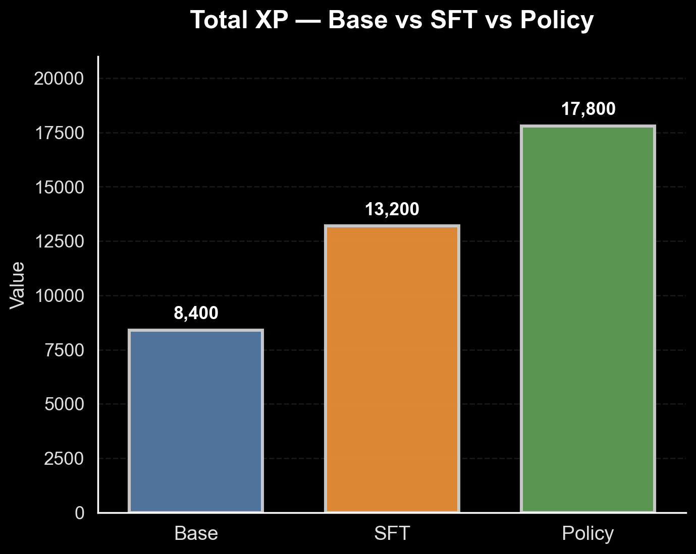</td>
<td>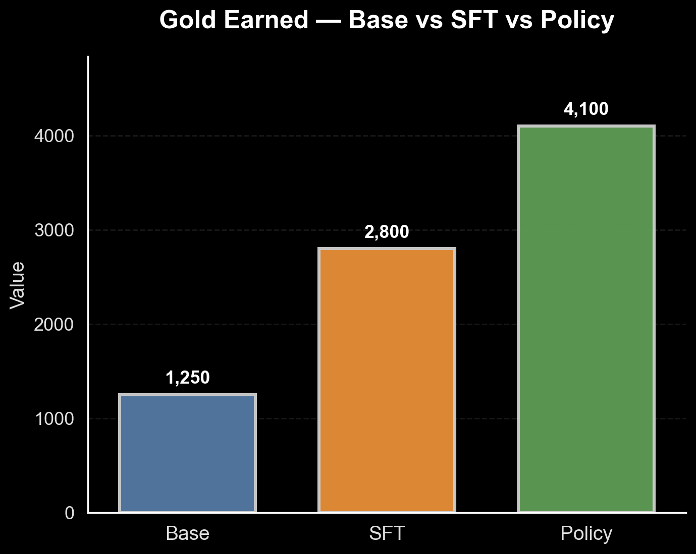</td>
</tr>
<tr>
<td>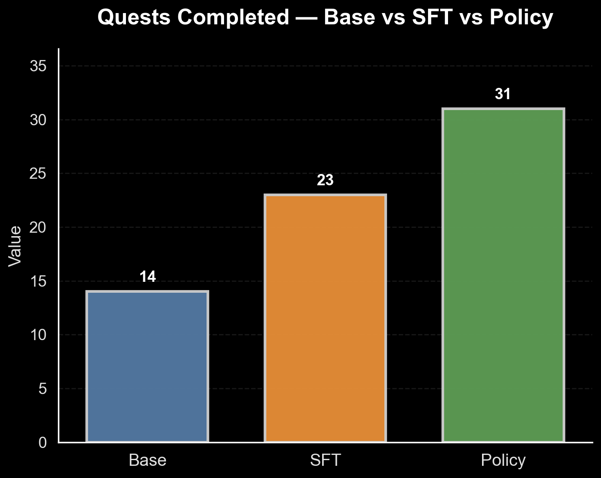</td>
<td>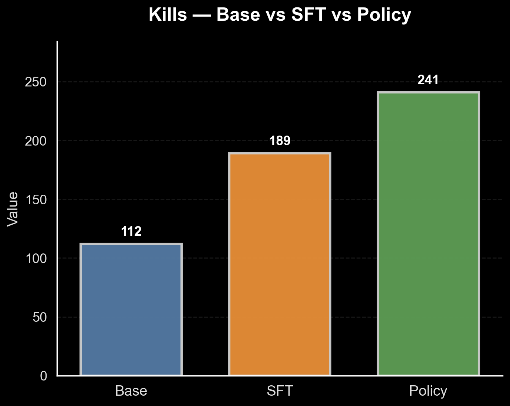</td>
</tr>
</table>

</div>

### Reward Weights

| Signal | Weight | Rationale |
|---|---|---|
|  Quest completed | **+50.0** | Primary objective |
|  Gold earned | **+3.0** | Core economy |
|  XP gained | **+0.1** | Progression |
|  Death | **−10.0** | Penalise reckless play |
| 🗺 New zone | **+5.0** | Encourage exploration |

### Policy Loop

Every 100 cycles the `PolicyEvaluator` runs:

```
score = gold×3 + quests×50 + xp×0.1 + deaths×(−10) + zones×5

EMA(α=0.3) → trend

   ┌─ keep    (85%) — score healthy
   ├─ explore (15%) — epsilon-greedy rewrite
   ├─ adopt        — score below threshold → meta-prompt rewrites strategy
   └─ revert       — 2+ declining windows → roll back to best-ever
```

---

## 🚀 Quick Start

### macOS Native Client

> Requires Apple Silicon Mac · Xcode 16+ · macOS 15+

```bash
git clone https://github.com/DasilvaKareem/WoG-Mistral-RL-0.git
open Frontend/Agent/Agent.xcodeproj
# ⌘R to build and run
```

1. Tap **Forge New Seal** → wallet generated and stored in Keychain
2. Choose your race and class
3. Tap **PLAY** → model loads, agent starts automatically

### NVIDIA Cloud Stack

> Requires [Modal](https://modal.com) account · W&B account (optional)

```bash
cd mistral
pip install modal wandb firebase-admin
modal setup

# One-time secrets
modal secret create wandb-secret WANDB_API_KEY=<key>
modal secret create firebase-admin \
  FIREBASE_SERVICE_ACCOUNT_JSON='<json>' \
  FIREBASE_STORAGE_BUCKET='<bucket>'

# Launch 8 parallel agents
modal run modal_runner.py

# Fine-tune on collected trajectories
modal run modal_runner.py::run_training

# Evaluate
modal run modal_runner.py::run_eval
```

---

## ⚙️ Configuration

### Swift (AgentRunner.swift)

| Constant | Default | Description |
|---|---|---|
| `tickInterval` | 3 s | Game loop cycle interval |
| `maxResponseChars` | 1500 | Max tool response fed to model |
| `maxNoToolRetries` | 3 | Failed cycles before hard reset |
| `memoryRefreshInterval` | 10 | Cycles between session rebuilds |
| `maxToolsChars` | 3000 | Tool block cap in system prompt |

### Python (app_nvidia.py)

| Constant | Default | Description |
|---|---|---|
| `MODEL_ID` | `Hermes-2-Pro-Mistral-7B` | HuggingFace model |
| `TICK_INTERVAL` | 3 s | Game loop cycle interval |
| `eval_interval` | 100 | Cycles between policy evaluations |
| `_EPSILON` | 0.15 | Strategy exploration rate |
| `_EMA_ALPHA` | 0.3 | Score smoothing factor |

---

<div align="center">

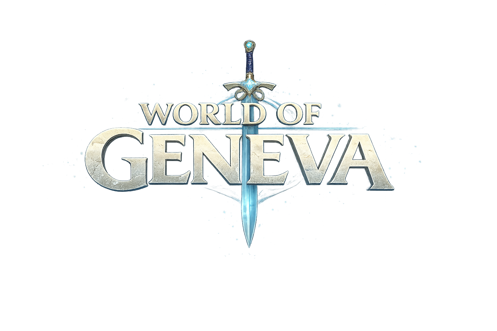

*Built with ❤️ on Apple Silicon and H100s*

**MIT License**

</div>
